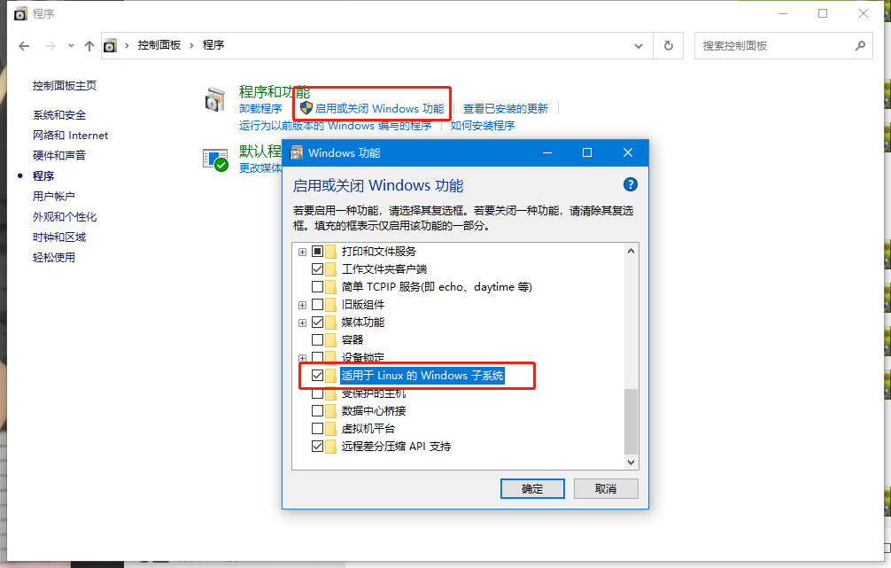
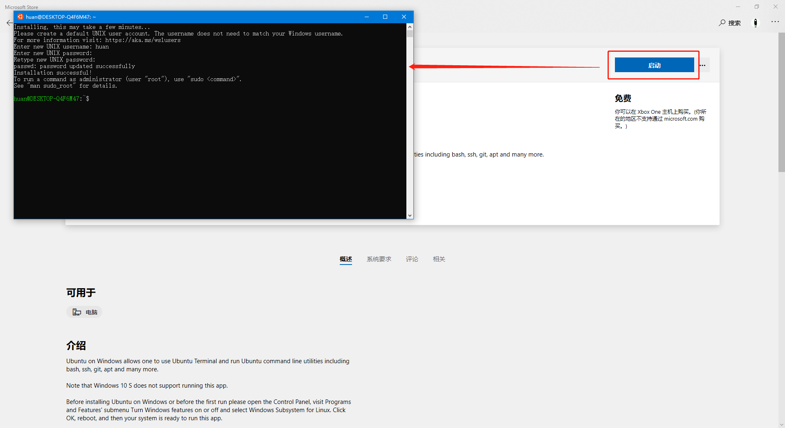

### windows python环境配置
- 基本思路：利用window10 wsl(https://docs.microsoft.com/zh-cn/windows/wsl/about)功能创建Ubuntu虚拟机，在虚拟机中配置python venv环境
- 使用的工具：
    - windows 10
    - windows Terminal
    - VS Code

1.开启windows子系统功能

2.在微软应用中下载Ubuntu和windows Terminal
- 在应用中搜索“wsl”，点击选择“Ubuntu”

- 安装，安装完成后点击“启动”，设置Ubuntu内的用户名和密码

- 安装windows Terminal

3.`wsl -l -v`查看wsl版本，当前最新版本为wsl2

4.进入Ubuntu，更新
- 进入Ubuntu的两种方式：
    - 输入命令`wsl`进入
    - 在windows Terminal新开一个Ubuntu窗口自动进入
- 更新：`apt update`

- 清除无用安装包：`sudo apt autoclean`

5.安装python
- 安装python2：`sudo apt install python-dev`
- 安装python3.8：`sudo apt install python3.8-dev`
- 安装pip：`sudo apt install python3-pip`
- 安装virtualenv：`sudo apt install python3-vritualenv`
- 点击Terminal的settings，修改文件内容，方便后续使用Ubuntu可以直接用自己的用户登录

6.python开发环境创建
- 使用virtualenv创建python开发环境并命名为“venv”：`virtualenv -p python3.8 venv`
- 进入到自己创建的开发环境中：`source venv/bin/activate`效果如下：

- 查看环境中已安装的包，并检查是否需要更新：`pip list -o`

7.在VS Code中配置连接该Ubuntu环境

出现如下界面则表示已连接：

修改settings.json文件使VS Code默认连接到配置好的python开发环境中

这样打开终端即默认进入开发环境中

8.在Ubuntu中安装systemd管理系统进程
- 进入项目https://github.com/arkane-systems/genie
- 找到如下位置：

- 点开第一个链接依次执行

- 点开第三个连接执行

- 执行`sudo apt install systemd-genie`成功

- 切换到root用户，修改.bash_aliases文件如下：

- 执行命令使修改生效

- 查看systemctl status命令是否能正常执行

